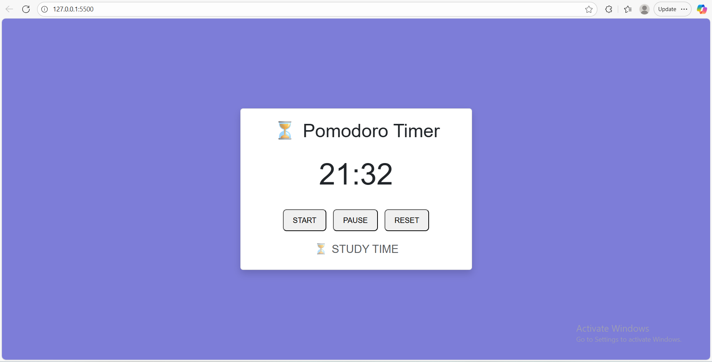

## ⌛Pomodoro Timer 

This is a clean,   user-friendly, and functional Pomodoro Timer built using HTML, CSS, and JavaScript. It helps to boost productivity using the Pomodoro Technique, 25 minutes of focused work followed by short breaks. This project is equally meant to provide an easy understanding of basic web coding, making it suitable for newbies in web development.

## 📸 Preview




# ⚙️Features
- Start, pause, and reset timer controls
- Default 25-minute Study session 
- visual countdown with minutes and seconds
- Session status indicator (Study/ Pause/ Reset)
- Responsive design with CSS and Bootstrap styling
- No external dependencies

# 💡How it works
- The countdown starts at 25:00 and decreases every second using JavaScript's setInterval() function
- The timer automatically stops at 0 and switches its status to " ✅BREAK TIME!
- The timer can be paused and resumed at any time
The reset button refreshes the timer back to 25 seconds, beginning a fresh study session.

# 🚀 Getting Started

1. **Fork** this repository 

2. **Clone** this repository into your local computer
```bash
     git clone https://github.com/your-username/Pomodoro-app.git
```
3. Open the HTML file in your browser.
4. Hit Start and begin your productivity session!

# 📜 License

This project is licensed under the MIT License.

# --------------- #
# List of updates
# Add sound notification 
# users should choose what they want to use it for.
# Have the option to add or increase the timer based on preference.